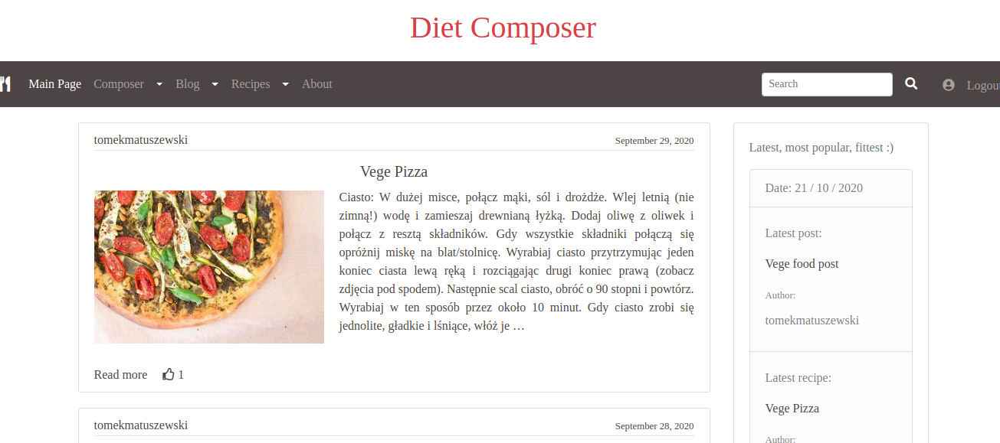
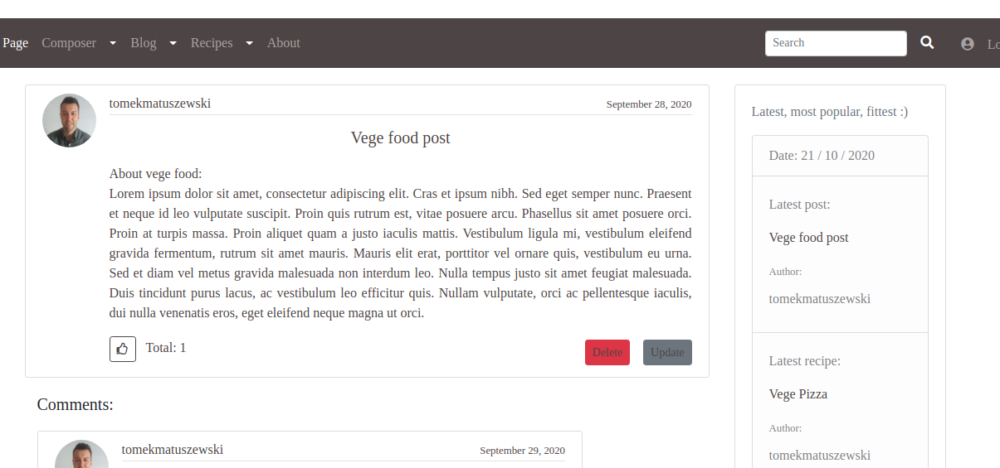
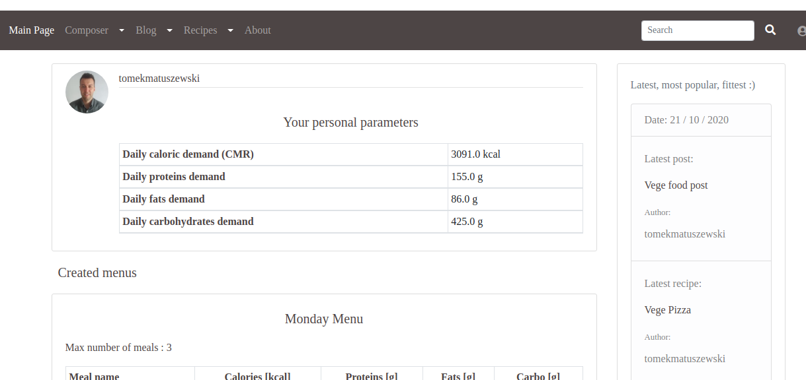
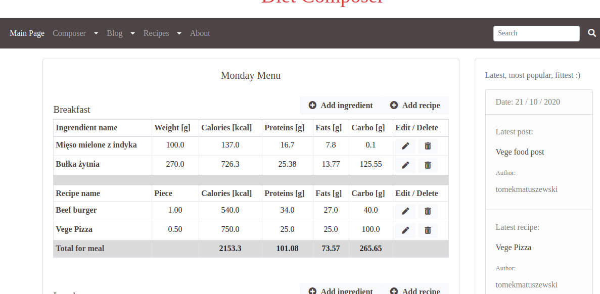

## Diet composer project

Application directed to people who want adapt diet to their lifestyle, body parameters and to be fit!

You can:

- create your own diet based on products from DB
- blog with other users on topics related with diet
- add Recipe ( nutritional parameters - must have !)
- added Recipe can be used by other users in their Diet
- register and get your own account

Project created in Django

All tested in Pytest 

    to check - . pytest
    
Front-End part created in Bootstrap with JavaScript

## STATUS

In progress!!

Current state on Develop:

Some screens:

 

